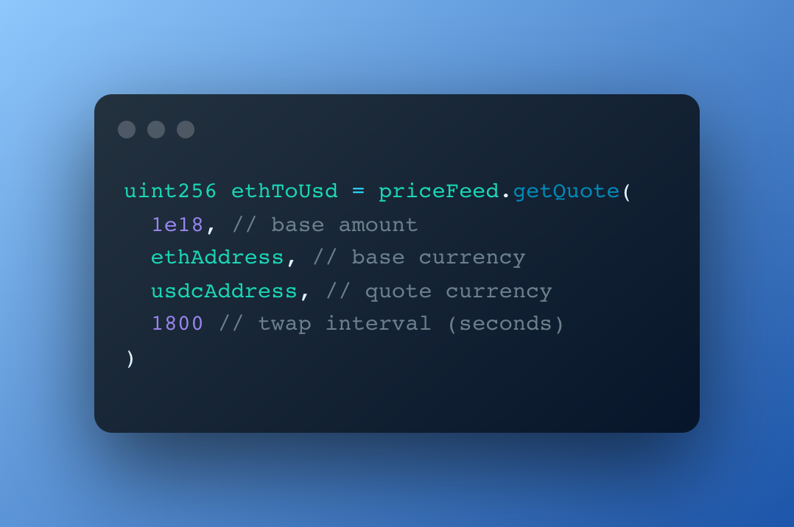

# Uniswap V3 TWAP Price Feed

#### Decentralized price feed based on Uniswap V3 TWAP oracles

---

Uniswap V3 pools can be used as decentralized price feed oracles. However they have intrinsic limitations, for example:

- It's not possible to programmatically retrieve quotes for a currency pair without knowing the reference pool in advance;
- Since every currency pair has multiple pools, each with a different fee, it's possible to get a wrong quote by querying a pool with low liquidity;
- Liquidity constantly varies in pools, so the most active pool for a currency pair can change over time;
- Interacting with Uniswap V3 TWAP oracles can be challenging or expensive.

The aim of this price feed is to solve these issues while providing increasingly reliable and efficient quotes the more users benefit from it.

## Rationale

Over sufficiently large time intervals, **harmonic mean liquidity (TWAL) can be used to programmatically determine the main / most traded pool for a currency pair**, among the ones with various fees.

> You can learn more about TWAL and Liquidity Oracles in the [Uniswap V3 Core whitepaper](https://uniswap.org/whitepaper-v3.pdf).

The price feed relies on the collaborative effort of users to keep updated the reference for the main pool for each currency pair. This is facilitated by `getUpdatedPool` and `getQuoteAndUpdatePool` which allow interacting with the feed while updating stale pools and increasing observation cardinality at the same time.

This design choice provides the following benefits:

1. Users can update pools and increase their cardinality more or less frequently, depending on their needs;
2. Users improve reliability of Uniswap V3 pools by increasing their cardinality as they interact with them;
3. The more the price feed is used, the higher its efficiency, reliability and usefulness for the Ethereum ecosystem.

At the same time anyone can use `getPool` to retrieve the current main pool for a currency pair, or `getQuote` to get a **time-weighted quote** by specifying the `currency addresses`, `the amount of base currency to convert` and the desired `twap interval`.

This makes it easy and efficient to interact with TWAP oracles or integrate them into other smart contracts.

> The price feed will soon be used by the [Slice protocol](https://slice.so) to provide dynamic pricing for products in any ERC20 currency, periodically updating the pools it interacts with.

## Functions

- `getPool`: Get the latest updated pool for a currency pair
- `getQuote`: Get quote from the latest updated pool for a currency pair
- `updatePool`: Update the main pool for a currency pair
- `getUpdatedPool`: Get the main pool for a currency pair, and update it if deemed stale
- `getQuoteAndUpdatePool`: Get quote given a currency pair and amount, and update main pool if deemed stale

See the specifics in the [PriceFeed](contracts/PriceFeed.sol) contract.

## Gotchas

- Quotes and updates don&apos;t trigger reverts, so any quote or pool equal to respectively `0` or `address(0)` has to be handled appropriately from the caller.
- Quotes represent a time-weighted average price for a currency in a certain amount of time (see [TWAP oracles](https://docs.uniswap.org/protocol/concepts/V3-overview/oracle)), or based on a spot price. As such they&apos;re well suited to estimate the value of a currency with respect to another, but they shouldn&apos;t be used to estimate with precision the amount received for a swap.
- While Uniswap V3 TWAP oracles are much more resilient to attacks than V2 pools, an incentivised party may still be able to manipulate the price significantly. This is especially valid for low liquidity pools.
- The price feed doesn&apos;t impose a specific TWAP interval, so care should be taken by the caller in choosing an appropriate value.

## Deployments

`PriceFeed` has been deployed to `0xf2E8176c0b67232b20205f4dfbCeC3e74bca471F` on the following networks:

- [Ethereum Mainnet](https://etherscan.io/address/0xf2E8176c0b67232b20205f4dfbCeC3e74bca471F)
- [Ethereum Goerli Testnet](https://goerli.etherscan.io/address/0xf2E8176c0b67232b20205f4dfbCeC3e74bca471F)

## Support the project

You can support the project by donating to its slicer or Juicebox treasury.

### [Slicer](https://slice.so/slicer/22)

By sending ETH to the slicer address `0x83c36BED51b6de81986390b6e64aDa045694E857` you're supporting the contributors of the project. Doing so will allow you to appear as sponsor in the slicer page.

> **Ownership over the slicer is split between the project's contributors**. You can check the ownership distribution in the [slicer page](https://slice.so/slicer/22?view=owners), or the specifics of past slice distributions on each merged PR.

### [Juicebox Treasury](https://juicebox.money/v2/p/264)

Funds sent to the [Juicebox treasury](https://juicebox.money/v2/p/264) are forwarded to the slicer. The only difference is that instead of appearing as a sponsor on the slicer page you&apos;ll receive tokens in exchange for your support.

## Contribute

This project uses [Foundry](https://github.com/foundry-rs/foundry) as development framework.

### Merge to earn

This project uses [Merge to earn](https://github.com/slice-so/merge-to-earn) to reward contributors with a piece of the [Price feed slicer](https://slice.so/slicer/22) and its earnings, when pull requests are merged.
